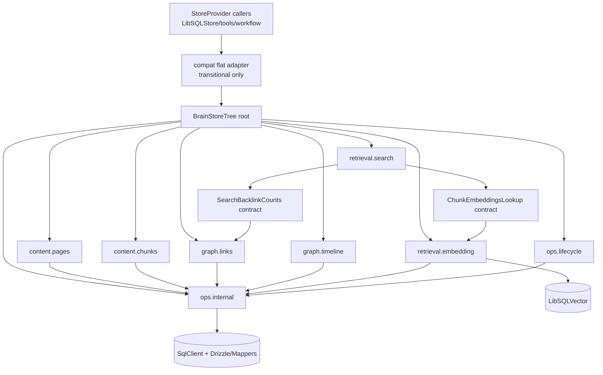

# Phase 09: brainstore-layered-contexts-and-boundaries - Research

**Researched:** 2026-04-25
**Domain:** Effect v4 store layering, BrainStore tree composition, compatibility-preserving refactor
**Confidence:** MEDIUM

<user_constraints>
## User Constraints (from CONTEXT.md)

### Locked Decisions
### Tree shape
- **D-01:** The target architecture is a mixed tree, not a flat capability list and not a pure single-axis split.
- **D-02:** The top level should be grouped by domain, with capability nodes hanging inside each domain branch.
- **D-03:** The intended branch shape is:
  - `content.pages`
  - `content.chunks`
  - `graph.links`
  - `graph.timeline`
  - `retrieval.search`
  - `retrieval.embedding`
  - `ops.lifecycle`
  - `ops.internal`
- **D-04:** `BrainStoreTree` is the architectural center. Any flat root surface is transitional only.

### Layer dependency policy
- **D-05:** Feature layers may depend on other feature layers, but only through explicit narrow contracts or tags.
- **D-06:** Sibling access through a broad root service is forbidden.
- **D-07:** The dependency rule is "explicit small-contract dependency", not "strict no-sibling access" and not "parent-only orchestration".

### Boundary Safety
- **D-08:** Do not widen `StoreProvider` or reintroduce direct Bun SQLite/runtime exposure in higher-level callers.
- **D-09:** Keep low-level SQL and lifecycle concerns fenced behind internal store layers.

### Compatibility and migration
- **D-10:** Keep a flat `BrainStore` adapter temporarily for migration compatibility.
- **D-11:** Internal architecture should move to `BrainStoreTree` first; compatibility root behavior is secondary.
- **D-12:** Existing callers may continue to use the compatibility adapter during migration, but new or refactored internal Effect code should target tree branches or narrow feature contracts directly.

### File and folder organization
- **D-13:** The layered store refactor should also split implementation into multiple folders automatically rather than keeping the architecture concentrated in a few large files.
- **D-14:** Each branch or feature layer should be organized inside its own folder using an `interface + factory + index` structure.
- **D-15:** The exact folder tree should follow the chosen `BrainStoreTree` branches so the on-disk structure mirrors the architectural tree as closely as practical.

### Verification
- **D-16:** Favor targeted regression coverage around the most dependency-heavy modules.
- **D-17:** Preserve current behavior first; architectural cleanup is only valid if adapters and consumers still work.
- **D-18:** Individual capabilities must be injectable and testable independently without requiring the full `BrainStore.Service`.

### Claude's Discretion
- Exact naming of intermediate contract tags under each branch.
- The exact folder names under each branch, as long as they respect the required `interface + factory + index` organization.
- The order in which consumers migrate off the compatibility adapter, as long as priority targets are narrowed early.

### Deferred Ideas (OUT OF SCOPE)
None. Discussion stayed within phase scope.
</user_constraints>

## Summary

The current implementation already has the outward shape of feature tags, but its assembly order is still flat-root first: it builds a full `BrainStore.Service` and then projects `BrainStoreIngestion`, `BrainStoreSearch`, and other child services out of `store.features.*`. That is the opposite of the Phase 09 direction: build independent layers first, then assemble `BrainStoreTree`.[VERIFIED: src/store/BrainStore.ts][VERIFIED: src/store/libsql-store.ts]

This phase should not start by cutting into the public `StoreProvider` boundary. It should start by changing internal Effect wiring order and on-disk structure: first split `libsql-store.ts` into branch-local `interface + factory + index` folders, then assemble `BrainStoreTree` in a dedicated `tree` layer, and finally keep a temporary flat adapter feeding `LibSQLStore` and tools/workflows.[VERIFIED: .planning/phases/09-brainstore-layered-contexts-and-boundaries/09-CONTEXT.md][VERIFIED: src/store/interface.ts][VERIFIED: src/store/libsql.ts]

Existing tests already prove that narrow dependency seams are viable: `hybridSearchEffect` only needs `BrainStoreSearch`, not the full root service; `ingest/workflow` and the `LibSQLStore` Promise adapter can continue running through a compatibility layer.[VERIFIED: test/search/hybrid.test.ts][VERIFIED: test/ingest/workflow.test.ts][VERIFIED: test/libsql.test.ts]

**Primary recommendation:** use an incremental refactor that adds `src/store/brainstore/{content,graph,retrieval,ops,tree,compat}` first, then turns `BrainStore.ts` and `libsql-store.ts` into thin entrypoints and assemblers rather than continuing to expand a flat root object.[VERIFIED: src/store/libsql-store.ts][VERIFIED: src/store/libsql.ts]

## Architectural Responsibility Map

| Capability | Primary Tier | Secondary Tier | Rationale |
|------------|-------------|----------------|-----------|
| BrainStore branch definitions (`content.*`, `graph.*`, `retrieval.*`, `ops.*`) | API / Backend | Database / Storage | These define the in-process dependency graph and service boundaries rather than a database schema migration, but every branch still bottoms out in SQLite/LibSQL and the vector store.[VERIFIED: src/store/BrainStore.ts][VERIFIED: src/store/libsql-store.ts] |
| LibSQL feature-layer factories | API / Backend | Database / Storage | `libsql-store.ts` currently builds feature services directly from `SqlClient`, `Mappers`, and `vectorStore`, so branch factories still belong to the backend tier while state ownership remains in the DB tier.[VERIFIED: src/store/libsql-store.ts][VERIFIED: src/store/Mappers.ts] |
| Final `BrainStoreTree` assembly | API / Backend | - | Tree assembly is dependency composition using `Context.Service`, `Layer.effect`, and `Layer.mergeAll`; it should not be pushed down into DB schema concerns.[VERIFIED: src/store/libsql-store.ts][VERIFIED: src/libs/effect-drizzle/sqlite.ts] |
| Flat compatibility adapter for `StoreProvider` / `LibSQLStore` | API / Backend | - | `LibSQLStore` currently reads the root service through `brainStore.runPromise(BrainStore.use(...))`, so the compat adapter must remain inside the backend boundary instead of leaking into tools/workflows public APIs.[VERIFIED: src/store/libsql.ts][VERIFIED: src/store/interface.ts] |
| Narrow consumer migration (`search/hybrid.ts`, `workflow/index.ts`) | API / Backend | - | These modules consume Effect services or Promise adapters rather than touching storage schema directly; their job is to shrink dependencies from the broad root to branch-local contracts.[VERIFIED: src/search/hybrid.ts][VERIFIED: src/workflow/index.ts] |
| Unsafe SQL / lifecycle fencing | API / Backend | Database / Storage | `UnsafeDBService` lifecycle and transaction hooks currently live inside store internals; Phase 09 should tighten that fence instead of exposing more runtime detail upward.[VERIFIED: src/store/BrainStore.ts][VERIFIED: src/store/libsql-store.ts][VERIFIED: code-review.md] |

## Project Constraints (from CLAUDE.md)

- The project is hard-constrained to **Effect v4 beta** and must not regress to v3 syntax or design patterns; the repo also prefers `Context.Service`, `Layer` composition, and explicit resource management.[VERIFIED: AGENTS.md][VERIFIED: CLAUDE.md]
- Storage boundaries must remain stable: low-level SQL/ORM/driver details may not leak outside `StoreProvider`, and all DB maintenance capabilities should stay behind store interfaces.[VERIFIED: AGENTS.md][VERIFIED: CLAUDE.md][VERIFIED: src/store/interface.ts]
- Code organization must stay factory-first and DI-first; do not reintroduce static singleton style `import store ...` bindings.[VERIFIED: AGENTS.md][VERIFIED: CLAUDE.md]
- Test databases must stay under `./tmp/`, and tests must clean up with `dispose()` rather than relying on global-singleton hacks.[VERIFIED: AGENTS.md][VERIFIED: CLAUDE.md][VERIFIED: test/ext.test.ts][VERIFIED: test/libsql.test.ts]
- Tokenization and retrieval code must keep honoring the multilingual `Intl.Segmenter` constraint rather than falling back to whitespace-only or ASCII-only logic.[VERIFIED: AGENTS.md][VERIFIED: CLAUDE.md][VERIFIED: src/store/libsql-store.ts]
- Delivery expectations still include `tsc --noEmit` and `bun test`; `scripts/check-effect-v4.sh` remains available as an extra local check.[VERIFIED: CLAUDE.md][VERIFIED: scripts/check-effect-v4.sh]
- Local Effect guidance files referenced from `AGENTS.md` are missing in this session, so this phase must follow the repository's current code patterns plus AGENTS/CLAUDE constraints rather than inventing rules from absent docs.[VERIFIED: AGENTS.md][VERIFIED: missing docs/effect/*]

## Standard Stack

Version guidance should be read in two layers: first, the versions actually pinned by this repository; second, the latest package-page versions observed on 2026-04-25. For this phase, the repository lock wins. Do not opportunistically upgrade core dependencies during the tree refactor, and do not downgrade back toward `effect` 3.x just because the stable npm page still foregrounds it.[VERIFIED: pnpm-lock.yaml][VERIFIED: npm registry][VERIFIED: AGENTS.md]

### Core
| Library | Version | Purpose | Why Standard |
|---------|---------|---------|--------------|
| `effect` | `4.0.0-beta.55` repo-pinned; npm stable channel still shows `3.17.13` on package page [VERIFIED: pnpm-lock.yaml][VERIFIED: npm registry] | Effect v4 service/tag/layer runtime | Phase 09 is fundamentally a service-graph refactor, so the repo-pinned v4 beta runtime is the correct baseline.[VERIFIED: AGENTS.md][VERIFIED: CLAUDE.md][VERIFIED: src/store/BrainStore.ts] |
| `@effect/platform-bun` | `4.0.0-beta.55` [VERIFIED: pnpm-lock.yaml][VERIFIED: npm registry] | Bun runtime integration | Keeps the Effect runtime aligned with the Bun host instead of introducing extra platform churn during store refactoring.[VERIFIED: pnpm-lock.yaml][VERIFIED: src/store/index.ts] |
| `@effect/sql-sqlite-bun` | `4.0.0-beta.55` [VERIFIED: pnpm-lock.yaml][VERIFIED: npm registry] | SQLite `SqlClient` for Effect layers | This is the DB foundation already used by `libsql-store.ts` branch factories.[VERIFIED: src/store/libsql-store.ts] |
| `@yuyi919/tslibs-effect` | `0.4.2` [VERIFIED: pnpm-lock.yaml] | Local wrapper / effect-next facade | Existing store code is already built around `Eff.fn`, `Eff.gen`, `Context`, and `Layer` helpers; the refactor should stay consistent with that style.[VERIFIED: src/store/BrainStore.ts][VERIFIED: src/store/libsql-store.ts] |
| `drizzle-orm` | `0.45.2` [VERIFIED: pnpm-lock.yaml][VERIFIED: npm registry] | Typed query construction and mapper backing | The repo explicitly prefers `SqlBuilder`/Drizzle over ad-hoc SQL string assembly inside branch code.[VERIFIED: CLAUDE.md][VERIFIED: src/store/Mappers.ts][VERIFIED: src/libs/effect-drizzle/sqlite.ts] |
| `@mastra/core` | `1.26.0` [VERIFIED: pnpm-lock.yaml][VERIFIED: npm registry] | Tools and workflow orchestration | Workflow code is already integrated on Mastra APIs; this phase should narrow the store seam, not replace the workflow framework.[VERIFIED: src/workflow/index.ts][VERIFIED: src/ingest/workflow.ts][CITED: https://mastra.ai/docs/workflows/overview] |
| `@mastra/libsql` | `1.9.0` [VERIFIED: pnpm-lock.yaml][VERIFIED: npm registry] | Vector store backend | `retrieval.embedding` should reuse the current `LibSQLVector`-backed implementation instead of inventing a second vector adapter.[VERIFIED: src/store/libsql.ts][VERIFIED: src/store/libsql-store.ts] |

### Supporting
| Library | Version | Purpose | When to Use |
|---------|---------|---------|-------------|
| `bun` | `1.3.12` installed [VERIFIED: bun --version] | Test/runtime/CLI host | Use for the current tests and scripts; Phase 09 validation stays centered on `bun test`.[VERIFIED: package.json][VERIFIED: bun --version] |
| `pnpm` | `10.12.1` installed [VERIFIED: pnpm --version] | Workspace/package management | Useful for lock/catalog inspection, but no package-manager switch is needed for this phase.[VERIFIED: pnpm-lock.yaml][VERIFIED: pnpm --version] |
| `node` | `v22.21.1` installed [VERIFIED: node --version] | Graphify/tooling runtime | Relevant for graphify and helper tooling, not for the main BrainStore refactor runtime.[VERIFIED: node --version] |
| `node-llama-cpp` | `3.18.1` [VERIFIED: pnpm-lock.yaml][VERIFIED: npm registry] | Local embedding/reranker support | This phase should preserve existing embedder-factory boundaries while leaving the current integration model intact.[VERIFIED: AGENTS.md][VERIFIED: src/store/index.ts] |

### Alternatives Considered
| Instead of | Could Use | Tradeoff |
|------------|-----------|----------|
| Mixed `BrainStoreTree` by domain | Flat capability bag | Rejected by the user constraints; the current code already shows how flat-first structure collapses feature layers back into root projection.[VERIFIED: .planning/phases/09-brainstore-layered-contexts-and-boundaries/09-CONTEXT.md][VERIFIED: src/store/libsql-store.ts] |
| Explicit narrow-contract sibling dependency | Parent-only orchestration | The user explicitly allows sibling dependency through small contracts; banning that would just push orchestration back into the root and bloat it again.[VERIFIED: .planning/phases/09-brainstore-layered-contexts-and-boundaries/09-CONTEXT.md] |
| Temporary flat compatibility adapter | Immediate public API break | Tools, agents, workflows, and scripts still depend on the `StoreProvider` Promise boundary, so dropping compat immediately would enlarge the migration surface too much.[VERIFIED: src/tools/search.ts][VERIFIED: src/tools/ingest.ts][VERIFIED: src/agent/index.ts][VERIFIED: src/store/interface.ts] |

**Installation:**
```bash
bun install
```

**Version verification:** `pnpm-lock.yaml` records the repo-pinned versions; npm package pages checked on 2026-04-25 matched `@mastra/core 1.26.0`, `@mastra/libsql 1.9.0`, `drizzle-orm 0.45.2`, `@effect/platform-bun 4.0.0-beta.55`, `@effect/sql-sqlite-bun 4.0.0-beta.55`, and `node-llama-cpp 3.18.1`, while the `effect` package page still foregrounded stable `3.17.13` even though this repo intentionally targets `4.0.0-beta.55` beta APIs.[VERIFIED: pnpm-lock.yaml][VERIFIED: npm registry][VERIFIED: AGENTS.md]

## Architecture Patterns

### System Architecture Diagram



The key point in the diagram is not file layout but dependency direction: new feature layers should depend directly on `ops.internal` or narrow sibling contracts; `BrainStoreTree` only performs final assembly; the flat compatibility adapter exists only for Promise/tool surfaces.[VERIFIED: src/store/libsql-store.ts][VERIFIED: src/store/libsql.ts][VERIFIED: .planning/phases/09-brainstore-layered-contexts-and-boundaries/09-CONTEXT.md]

### Recommended Project Structure
```text
src/
|-- store/
|   |-- BrainStore.ts              # transitional barrel + public types re-export
|   |-- libsql-store.ts            # transitional libsql composition entry
|   |-- libsql.ts                  # stable Promise adapter
|   `-- brainstore/
|       |-- content/
|       |   |-- pages/
|       |   |   |-- interface.ts
|       |   |   |-- factory.ts
|       |   |   `-- index.ts
|       |   `-- chunks/
|       |       |-- interface.ts
|       |       |-- factory.ts
|       |       `-- index.ts
|       |-- graph/
|       |   |-- links/
|       |   |   |-- interface.ts
|       |   |   |-- factory.ts
|       |   |   `-- index.ts
|       |   `-- timeline/
|       |       |-- interface.ts
|       |       |-- factory.ts
|       |       `-- index.ts
|       |-- retrieval/
|       |   |-- search/
|       |   |   |-- interface.ts
|       |   |   |-- factory.ts
|       |   |   `-- index.ts
|       |   `-- embedding/
|       |       |-- interface.ts
|       |       |-- factory.ts
|       |       `-- index.ts
|       |-- ops/
|       |   |-- lifecycle/
|       |   |   |-- interface.ts
|       |   |   |-- factory.ts
|       |   |   `-- index.ts
|       |   `-- internal/
|       |       |-- interface.ts
|       |       |-- factory.ts
|       |       `-- index.ts
|       |-- tree/
|       |   |-- interface.ts
|       |   |-- factory.ts
|       |   `-- index.ts
|       `-- compat/
|           |-- interface.ts
|           |-- factory.ts
|           `-- index.ts
```

The lowest-risk migration strategy is to add this tree in parallel while keeping `BrainStore.ts` and `libsql-store.ts` as thin facades until `LibSQLStore` and internal consumers have fully switched over.[VERIFIED: src/store/BrainStore.ts][VERIFIED: src/store/libsql-store.ts][VERIFIED: src/store/libsql.ts]

### Pattern 1: Branch-Local `interface + factory + index`
**What:** Each branch exposes contracts in `interface.ts`, constructors/layers in `factory.ts`, and a light export/assembly surface in `index.ts`.[VERIFIED: .planning/phases/09-brainstore-layered-contexts-and-boundaries/09-CONTEXT.md]

**When to use:** Use this when a feature needs independent injection, may be consumed through a narrow sibling contract, but should not touch the broad root directly.[VERIFIED: .planning/phases/09-brainstore-layered-contexts-and-boundaries/09-CONTEXT.md][VERIFIED: test/search/hybrid.test.ts]

**Example:**
```typescript
// Source: repo pattern adapted from src/store/BrainStore.ts and src/store/Mappers.ts
export interface SearchBacklinkCounts {
  getBacklinkCounts(slugs: string[]): EngineEffect<Map<string, number>>;
}

export interface ChunkEmbeddingsLookup {
  getEmbeddingsByChunkIds(ids: number[]): EngineEffect<Map<number, Float32Array>>;
}

export class RetrievalSearch extends Context.Service<
  RetrievalSearch,
  BrainStore.Search
>()("@yui-agent/brain-mastra/BrainStoreTree/Retrieval/Search") {}

export const makeRetrievalSearchLayer = Layer.effect(
  RetrievalSearch,
  Eff.gen(function* () {
    const db = yield* OpsInternal;
    const backlinks = yield* SearchBacklinkCountsTag;
    const embeddings = yield* ChunkEmbeddingsLookupTag;
    return makeSearchService({ db, backlinks, embeddings });
  })
);
```

### Pattern 2: Root-last assembly, compat-last adapter
**What:** Build real branch services first, combine them into `BrainStoreTree` in `tree/factory.ts`, and only then fold that tree back into a legacy flat surface in `compat/factory.ts`.[VERIFIED: .planning/todos/completed/2026-04-24-split-brainstore-into-layered-contexts.md][VERIFIED: src/store/libsql-store.ts]

**When to use:** Use this while public callers still depend on `StoreProvider`/`BrainStore.Service` but internal Effect code can already target branch-local tags.[VERIFIED: src/store/interface.ts][VERIFIED: src/store/libsql.ts]

**Example:**
```typescript
// Source: repo pattern adapted from src/store/libsql-store.ts
const TreeLayer = Layer.mergeAll(
  ContentPagesLive,
  ContentChunksLive,
  GraphLinksLive,
  GraphTimelineLive,
  RetrievalEmbeddingLive,
  RetrievalSearchLive,
  OpsLifecycleLive,
  OpsInternalLive
).pipe(Layer.provide(DatabaseLive));

const CompatLayer = Layer.effect(
  BrainStore,
  BrainStoreTree.use((tree) => Effect.succeed(makeCompatBrainStore(tree)))
).pipe(Layer.provide(TreeLayer));
```

### Recommended Branch-Local Contracts

The highest-value early extractions are the narrow contracts below. Search-related ones already exist in practice today; the rest are conservative recommendations based on the current implementation and the locked tree shape.[VERIFIED: src/store/libsql-store.ts][ASSUMED]

| Consumer Branch | Contract | Likely Provider | Evidence / Why |
|-----------------|----------|-----------------|----------------|
| `retrieval.search` | `SearchBacklinkCounts { getBacklinkCounts }` | `graph.links` | Current search wiring already reuses `link.getBacklinkCounts`, making this the clearest sibling seam.[VERIFIED: src/store/libsql-store.ts] |
| `retrieval.search` | `ChunkEmbeddingsLookup { getEmbeddingsByChunkIds }` | `retrieval.embedding` preferred, transitional `content.chunks` acceptable | Search already reuses `ingestion.getEmbeddingsByChunkIds`; under the target tree the more natural long-term home is `retrieval.embedding`, but migration can bridge from the old implementation first.[VERIFIED: src/store/libsql-store.ts][ASSUMED] |
| `content.chunks` | `EmbeddingWritePort { upsertVectors, deleteVectorsBySlug }` | `retrieval.embedding` | `upsertChunks` currently writes chunk rows, FTS, and vector state together; without an extracted write contract, vector behavior remains tightly bound to the content branch.[VERIFIED: src/store/libsql-store.ts][ASSUMED] |
| `graph.timeline` / `content.pages` write flows | `StoreTransactor` or `LifecycleTransaction` | `ops.lifecycle` | Transaction semantics belong to lifecycle orchestration, not to content branches themselves.[VERIFIED: src/store/BrainStore.ts][VERIFIED: src/store/libsql-store.ts] |
| All public branches | `OpsInternal` hidden interface | `ops.internal` | `SqlClient`, `Mappers`, unsafe SQL, and vector resource cleanup should remain in the internal branch and stay out of public branch `index.ts` surfaces.[VERIFIED: src/store/libsql-store.ts][VERIFIED: code-review.md] |

### Anti-Patterns to Avoid
- **Projecting feature layers back out of the broad root:** this is the core flat-first failure mode in the current implementation.[VERIFIED: src/store/libsql-store.ts]
- **Letting new internal Effect code depend on the `BrainStore` root:** the user has already ruled out sibling access through the broad root; new code should depend on branch tags or narrow contracts instead.[VERIFIED: .planning/phases/09-brainstore-layered-contexts-and-boundaries/09-CONTEXT.md]
- **Changing the public Promise boundary at the same time as Phase 09:** tools, agents, workflows, and scripts still rely on `StoreProvider`, so compatibility should remain in place during the refactor.[VERIFIED: src/store/interface.ts][VERIFIED: src/tools/search.ts][VERIFIED: src/agent/index.ts]
- **Bundling transaction repair, architecture split, and dependency upgrades into one wave:** rollback semantics are already known debt and should not be exploded together with the tree migration.[VERIFIED: test/libsql.test.ts][VERIFIED: src/store/libsql.ts]

## Don't Hand-Roll

| Problem | Don't Build | Use Instead | Why |
|---------|-------------|-------------|-----|
| Feature dependency wiring | Custom service locator / manual object graph | Effect `Context.Service` + `Layer.effect` + `Layer.mergeAll` | The repository already uses this pattern; manually wiring more objects just reproduces the current flat-first problem.[VERIFIED: src/store/BrainStore.ts][VERIFIED: src/store/libsql-store.ts][VERIFIED: src/libs/effect-drizzle/sqlite.ts] |
| Query composition inside branch factories | Ad-hoc string SQL assembly | `SqlBuilder` + Drizzle mapper layer | The repo standard is still structured query construction, not handwritten SQL sprawl.[VERIFIED: CLAUDE.md][VERIFIED: src/store/Mappers.ts][VERIFIED: src/store/SqlBuilder.ts] |
| Runtime compatibility bridge | New parallel Promise store API | Temporary flat adapter over `BrainStoreTree` | A second Promise API would double the migration surface instead of shrinking it.[VERIFIED: src/store/libsql.ts][VERIFIED: src/store/interface.ts][VERIFIED: src/tools/ingest.ts] |
| Feature-isolation tests | Whole-store integration doubles for every test | Narrow service runtime tests like `BrainStoreSearch`-only runtime | The repo already shows that branch-only tests are lighter and more stable.[VERIFIED: test/search/hybrid.test.ts] |

**Key insight:** Phase 09 is not about inventing a prettier object graph. It is about changing dependency direction from "root owns everything" to "feature owns itself, root only assembles". The more temporary glue is handwritten, the easier it is to drift back into flat-first planning.[VERIFIED: .planning/todos/completed/2026-04-24-split-brainstore-into-layered-contexts.md][VERIFIED: src/store/libsql-store.ts]

## Runtime State Inventory

| Category | Items Found | Action Required |
|----------|-------------|------------------|
| Stored data | None relevant to this phase: the refactor target is in-process service composition, and inspected files show no planned rename of persisted schema names, vector index names, or config keys as part of Phase 09.[VERIFIED: src/store/libsql-store.ts][VERIFIED: src/store/init.sql][VERIFIED: src/store/schema.ts] | None - code edit only. |
| Live service config | None found in repo scope: no checked-in external dashboard/workflow/service config references `BrainStoreTree` or the planned branch names; this phase does not alter Mastra cloud config or remote control-plane settings.[VERIFIED: codebase grep][ASSUMED] | None expected. |
| OS-registered state | None found: this phase does not rename executables, services, scheduled tasks, or system registrations.[VERIFIED: codebase grep] | None. |
| Secrets/env vars | Existing env usage is around embedder/model/vector auth, not BrainStore layering names; Phase 09 does not require env key renames.[VERIFIED: AGENTS.md][VERIFIED: src/store/index.ts][VERIFIED: src/store/libsql.ts] | None - keep the existing env contract stable. |
| Build artifacts | Possible stale `dist`/tsbuild outputs are not semantically tied to the old BrainStore shape; rebuilding is sufficient after refactor.[VERIFIED: repository layout][ASSUMED] | Rebuild/test only; no data migration. |

## Common Pitfalls

### Pitfall 1: Looks like a feature tag, still behaves like a flat root
**What goes wrong:** New folders and tags get added, but `makeLayer()` still builds a full `BrainStore.Service` first and then projects `store.features.*` outward, so the internal dependency direction never actually changes.[VERIFIED: src/store/libsql-store.ts]

**Why it happens:** The repo already has tags such as `BrainStoreIngestion` and `BrainStoreSearch`, so it is easy to mistake the current state for a layered architecture.[VERIFIED: src/store/BrainStore.ts]

**How to avoid:** Require each branch factory to depend directly on `ops.internal` or narrow sibling contracts; do not allow a broad root object to appear before `tree/factory.ts`.[VERIFIED: .planning/todos/completed/2026-04-24-split-brainstore-into-layered-contexts.md][ASSUMED]

**Warning signs:** `BrainStore.use((store) => store.features.*)` is still the main assembly mechanism.[VERIFIED: src/store/libsql-store.ts]

### Pitfall 2: Letting `StoreProvider` absorb new internal dependencies
**What goes wrong:** Branch methods keep getting added to `StoreProvider` and `LibSQLStore`, the public boundary swells, and compat becomes impossible to remove later.[VERIFIED: src/store/interface.ts][VERIFIED: src/store/libsql.ts]

**Why it happens:** Tools and workflows already sit on the Promise boundary, so developers naturally reach for it again.[VERIFIED: src/tools/search.ts][VERIFIED: src/tools/ingest.ts][VERIFIED: src/workflow/index.ts]

**How to avoid:** Route all new internal Effect consumers through branch tags first; only legacy Promise callers should remain on `StoreProvider`.[VERIFIED: .planning/phases/09-brainstore-layered-contexts-and-boundaries/09-CONTEXT.md]

**Warning signs:** `interface.ts` keeps growing, or `LibSQLStore` gains many one-to-one forwarding methods.[VERIFIED: src/store/interface.ts][VERIFIED: src/store/libsql.ts]

### Pitfall 3: Bundling transaction debt with the tree refactor
**What goes wrong:** A refactor wave tries to fix real cross-call rollback semantics at the same time, and the phase drifts from layering work into a database consistency project.[VERIFIED: src/store/libsql.ts][VERIFIED: test/libsql.test.ts]

**Why it happens:** The current `transaction()` compatibility path is only a direct callback execution, and rollback tests are still skipped, so the debt looks tempting to repair opportunistically.[VERIFIED: src/store/libsql.ts][VERIFIED: test/libsql.test.ts]

**How to avoid:** Keep Phase 09 focused on compatibility-preserving structure changes and leave stronger transaction semantics to a separate phase.[VERIFIED: .planning/phases/09-brainstore-layered-contexts-and-boundaries/09-CONTEXT.md][ASSUMED]

**Warning signs:** Planning tasks start mentioning rebuilt `StoreProvider` transaction semantics or unified bun sqlite/effect-sql transaction handling.[VERIFIED: src/store/libsql.ts]

### Pitfall 4: Only writing integration tests, not branch-only seam tests
**What goes wrong:** Every regression path depends on a real `LibSQLStore` instance, so the planner cannot prove that a branch is independently injectable.[VERIFIED: test/ext.test.ts][VERIFIED: test/libsql.test.ts]

**Why it happens:** Real-store tests are already available and quick to write, while branch-local runtime tests require new tags and fixtures.[VERIFIED: test/search/hybrid.test.ts]

**How to avoid:** Each time a key consumer is narrowed, add one test slice that only provides the minimum branch contract.[VERIFIED: test/search/hybrid.test.ts][ASSUMED]

**Warning signs:** Every new test still boots `new LibSQLStore(...)`, and there are no `Layer.succeed(FeatureTag, ...)` style cases.[VERIFIED: codebase grep]

## Code Examples

Verified patterns from repository and official docs:

### Narrow feature injection for search
```typescript
// Source: test/search/hybrid.test.ts
const runtime = ManagedRuntime.make(
  Layer.succeed(
    BrainStoreSearch,
    BrainStoreSearch.of({
      searchKeyword: () => Effect.succeed([result] as any),
      searchVector: () => Effect.succeed([] as any),
      getBacklinkCounts: () => Effect.succeed(new Map([["a", 0]]) as any),
      getEmbeddingsByChunkIds: () => Effect.succeed(new Map() as any),
    } as any)
  )
);
```
[VERIFIED: test/search/hybrid.test.ts]

### Effect mapper layer composition
```typescript
// Source: src/store/Mappers.ts
export class Mappers extends Context.Service<Mappers, SqlBuilder>()(
  "@yui-agent/brain-mastra/BrainStore/Mappers",
  {
    make: Eff.gen(function* () {
      const db = yield* SqliteDrizzle.DB;
      return new SqlBuilder(db as any);
    }),
  }
) {
  static makeLayer(): Eff.Layer<Mappers, never, SqlClient> {
    return Layer.effect(Mappers, Mappers.make).pipe(
      Layer.provide(
        SqliteDrizzle.makeLayer({
          schema: Schemas,
        })
      )
    );
  }
}
```
[VERIFIED: src/store/Mappers.ts][VERIFIED: src/libs/effect-drizzle/sqlite.ts]

### Mastra workflow entry remains on stable Promise boundary
```typescript
// Source: src/workflow/index.ts
export const Ingest = BrainStoreProvider.use(({ store, embedder }) => {
  return Effect.gen(function* () {
    return createIngestionWorkflow({
      store,
      embedder,
    });
  });
});
```
[VERIFIED: src/workflow/index.ts][CITED: https://mastra.ai/docs/workflows/overview]

## Migration Order

The safest migration sequence is: define the tree and branch factories first, then change assembly, then narrow consumer seams, and only then touch the internals of the compatibility adapter.[VERIFIED: .planning/phases/09-brainstore-layered-contexts-and-boundaries/09-CONTEXT.md][VERIFIED: src/store/libsql-store.ts]

1. `src/store/BrainStore.ts`
   Add `BrainStoreTree` types, branch tags, compat adapter types, and exports without deleting the old `BrainStore.Service` surface yet.[VERIFIED: src/store/BrainStore.ts]
2. `src/store/libsql-store.ts`
   Split the current `ingestion/link/search/timeline/ext/lifecycle/unsafe` object into branch factories while keeping the public `makeLayer()` signature stable.[VERIFIED: src/store/libsql-store.ts]
3. `src/store/libsql.ts`
   Move `run()`/`runFlatten()` off broad `BrainStore.use(...)` and onto compat-over-tree wiring while preserving the existing Promise API.[VERIFIED: src/store/libsql.ts]
4. `src/store/index.ts`
   Keep `createDefaultStore()` and `BrainStoreProvider` stable from the outside while repointing the internal provider to the new tree-based runtime.[VERIFIED: src/store/index.ts]
5. `src/search/hybrid.ts`
   This is the highest-priority seam narrowing target because it already has `BrainStoreSearch`-only tests proving independent injection.[VERIFIED: test/search/hybrid.test.ts][VERIFIED: src/search/hybrid.ts]
6. `src/workflow/index.ts`
   Handle last; it only passes `store + embedder` into workflows and can remain on a stable Promise boundary while the tree settles.[VERIFIED: src/workflow/index.ts][VERIFIED: src/ingest/workflow.ts]

## Recommended Plan Waves

| Wave | Goal | Files | Exit Condition |
|------|------|-------|----------------|
| Wave 0 | Establish tree model and directory skeleton | `src/store/BrainStore.ts`, new `src/store/brainstore/**` | Branch tags/types and tree/compat types compile, but consumers have not moved yet.[VERIFIED: src/store/BrainStore.ts][ASSUMED] |
| Wave 1 | Convert `libsql-store.ts` to branch-first factory + root-last assembly | `src/store/libsql-store.ts`, new factories | Feature tags are no longer projected out of `BrainStore.use(...features.*)`, while the compat flat adapter still works.[VERIFIED: src/store/libsql-store.ts][ASSUMED] |
| Wave 2 | Move `libsql.ts` and `search/hybrid.ts` to new seams | `src/store/libsql.ts`, `src/search/hybrid.ts`, search tests | `hybridSearchEffect` and the Promise adapter both pass targeted regression coverage.[VERIFIED: src/store/libsql.ts][VERIFIED: test/search/hybrid.test.ts] |
| Wave 3 | Finish provider/wiring and workflow compatibility | `src/store/index.ts`, `src/workflow/index.ts` | `BrainStoreProvider` remains stable externally and workflow/tool paths do not change.[VERIFIED: src/store/index.ts][VERIFIED: src/workflow/index.ts] |

## Likely File Moves

- `src/store/BrainStore.ts` interface/tag/type definitions are likely to move into `src/store/brainstore/*/interface.ts` plus `tree/interface.ts`, leaving `BrainStore.ts` as a barrel.[VERIFIED: src/store/BrainStore.ts][ASSUMED]
- Large constant blocks inside `src/store/libsql-store.ts` such as `ingestion`, `link`, `hybridSearch`, `timeline`, `ext`, `lifecycle`, and `unsafe` are likely to be split across branch `factory.ts` files.[VERIFIED: src/store/libsql-store.ts]
- `src/store/index.ts` should stay a default factory/provider entrypoint rather than gaining more shape definitions.[VERIFIED: src/store/index.ts]
- `src/store/interface.ts` should remain mostly in place as the public boundary-preservation file even after the internal tree is complete.[VERIFIED: src/store/interface.ts]

## State of the Art

| Old Approach | Current Approach | When Changed | Impact |
|--------------|------------------|--------------|--------|
| Flat `BrainStore.Service` as architectural center | Tree-first branch composition with flat adapter only for compatibility | User locked in repaired Phase 09 context on 2026-04-25.[VERIFIED: .planning/phases/09-brainstore-layered-contexts-and-boundaries/09-CONTEXT.md] | Planning focus moves from interface cutting to dependency-direction correction. |
| Feature tags projected out of root | Branch services built independently then assembled | Recommended for this phase; current code has not completed this transition yet.[VERIFIED: src/store/libsql-store.ts][ASSUMED] | Assembly order becomes an explicit planning task instead of an implicit file-splitting side effect. |
| Broad `StoreProvider`-shaped internal dependencies | Internal Effect code depends on feature tags / narrow contracts | `hybridSearchEffect` already demonstrates feasibility, while workflows/tools can remain temporarily on the Promise boundary.[VERIFIED: test/search/hybrid.test.ts][VERIFIED: src/workflow/index.ts][VERIFIED: src/tools/search.ts] | Migration can happen in waves instead of a single breaking rewrite. |

**Deprecated/outdated:**
- `BrainStore.use((store) => Eff.succeed(store.features.*))` as the primary feature-layer construction pattern. This is the flat-first smell Phase 09 is meant to remove.[VERIFIED: src/store/libsql-store.ts]
- Treating `StoreProvider` as the default dependency for new internal Effect code. That should remain only for compat callers.[VERIFIED: src/store/interface.ts][VERIFIED: .planning/phases/09-brainstore-layered-contexts-and-boundaries/09-CONTEXT.md]

## Assumptions Log

| # | Claim | Section | Risk if Wrong |
|---|-------|---------|---------------|
| A1 | `getEmbeddingsByChunkIds` fits better under `retrieval.embedding` than `content.chunks`. | Recommended Branch-Local Contracts | Search/chunks contract naming and folder placement would need to change. |
| A2 | `EmbeddingWritePort` should become its own sibling contract instead of staying embedded in `content.chunks`. | Recommended Branch-Local Contracts | `retrieval.embedding` could become a hollow or duplicate branch. |
| A3 | This phase does not redefine rollback semantics; it preserves the current `transaction()` compatibility behavior. | Common Pitfalls / Migration Order | The wave scope and verification surface would grow significantly. |
| A4 | The new root folder should be `src/store/brainstore/` rather than moving all existing top-level files immediately. | Recommended Project Structure | File-move planning would need to be redone. |
| A5 | This phase does not touch repo-external live service config or OS registrations. | Runtime State Inventory | Manual migration steps could be missed if such runtime state actually exists. |

## Open Questions (RESOLVED)

1. **`retrieval.embedding` 的职责边界要多窄？**
   - RESOLVED: `retrieval.embedding` 统一拥有向量查询、向量写入、`getEmbeddingsByChunkIds`、`getStaleChunks`、`markChunksEmbedded` 以及相关 stale/vector 辅助能力。
   - RESOLVED: `content.chunks` 只保留 chunk/FTS CRUD 与页面关联职责，不再隐式携带向量读写能力。
   - RESOLVED: `retrieval.search` 只通过显式的小合同读取 embedding 能力，不通过 broad root 访问 sibling。

2. **`BrainStoreProvider` 是否需要立刻暴露更多 internal tree access？**
   - RESOLVED: 本 phase 不扩大 `BrainStoreProvider` 形状，继续保持 `{ store, embedder }` 稳定边界。
   - RESOLVED: tree access 留在内部 Effect wiring、`tree/*` 与 `compat/*` 组装层中处理，不让 workflow/tools 直接感知内部树结构。
   - RESOLVED: 兼容策略保持为 “compat-over-tree”，而不是通过 provider 暴露更多内部节点。

## Environment Availability

| Dependency | Required By | Available | Version | Fallback |
|------------|------------|-----------|---------|----------|
| Bun | Tests, runtime, scripts | yes | `1.3.12` [VERIFIED: bun --version] | none |
| Node.js | graphify/tooling helpers | yes | `v22.21.1` [VERIFIED: node --version] | none |
| pnpm | lock/catalog inspection, workspace tooling | yes | `10.12.1` [VERIFIED: pnpm --version] | none |
| `scripts/check-effect-v4.sh` | Optional Effect self-check | yes | script present [VERIFIED: scripts/check-effect-v4.sh] | If skipped, rely on targeted tests + typecheck. |

**Missing dependencies with no fallback:**
- None identified for planning this phase.[VERIFIED: bun --version][VERIFIED: node --version][VERIFIED: pnpm --version]

**Missing dependencies with fallback:**
- None identified.[VERIFIED: bun --version][VERIFIED: node --version][VERIFIED: pnpm --version]

## Validation Architecture

### Test Framework
| Property | Value |
|----------|-------|
| Framework | `bun test` on Bun `1.3.12` [VERIFIED: package.json][VERIFIED: bun --version] |
| Config file | none explicit; Bun default test discovery [VERIFIED: package.json][VERIFIED: repository layout] |
| Quick run command | `bun test test/search/hybrid.test.ts test/ingest/workflow.test.ts test/libsql.test.ts` [VERIFIED: test run 2026-04-25] |
| Full suite command | `bun test` (repo script wraps `pnpm clean && bun test`) [VERIFIED: package.json] |

### Phase Requirements -> Test Map
| Req ID | Behavior | Test Type | Automated Command | File Exists? |
|--------|----------|-----------|-------------------|-------------|
| P09-01 | `retrieval.search` can be injected independently of full root | unit/runtime | `bun test test/search/hybrid.test.ts` | yes |
| P09-02 | `StoreProvider` compatibility adapter still supports ingestion flow | integration | `bun test test/ingest/workflow.test.ts` | yes |
| P09-03 | `LibSQLStore` Promise boundary remains behavior-compatible after tree refactor | integration | `bun test test/libsql.test.ts` | yes |
| P09-04 | branch-first assembly builds `BrainStoreTree` before compat flat adapter | unit/runtime | `bun test test/store/brainstore-tree.test.ts` | no - Wave 0 |
| P09-05 | internal feature layers can be constructed with minimal dependencies (pages/chunks/links/timeline/ext) | unit/runtime | `bun test test/store/brainstore-layers.test.ts` | no - Wave 0 |

### Sampling Rate
- **Per task commit:** `bun test test/search/hybrid.test.ts test/ingest/workflow.test.ts test/libsql.test.ts`
- **Per wave merge:** `bun test`
- **Phase gate:** Full suite green before `/gsd-verify-work`

### Wave 0 Gaps
- [ ] `test/store/brainstore-tree.test.ts` -> proves branch-first assembly and compat adapter projection.
- [ ] `test/store/brainstore-layers.test.ts` -> proves pages/chunks/links/timeline/ext/lifecycle/internal can be layered independently.
- [ ] One regression test asserting no production assembly path uses `BrainStore.use((store) => store.features.*)` as feature construction.
- [ ] Optional static check or grep-based assertion keeping `UnsafeDB` / `ops.internal` out of public branch indexes.

## Security Domain

### Applicable ASVS Categories

| ASVS Category | Applies | Standard Control |
|---------------|---------|-----------------|
| V2 Authentication | no | This phase does not redesign auth flows.[VERIFIED: phase scope] |
| V3 Session Management | no | This repo package has no session boundary in the targeted files.[VERIFIED: codebase grep] |
| V4 Access Control | yes | Enforce branch/public boundary: keep `ops.internal` and unsafe SQL off broad public surfaces.[VERIFIED: .planning/phases/09-brainstore-layered-contexts-and-boundaries/09-CONTEXT.md][VERIFIED: src/store/BrainStore.ts] |
| V5 Input Validation | yes | Continue using Zod at tools/workflows and typed Drizzle mapper/query builders in store internals.[VERIFIED: src/ingest/workflow.ts][VERIFIED: src/tools/search.ts][VERIFIED: src/store/Mappers.ts] |
| V6 Cryptography | no | No new crypto is introduced in this refactor; existing token-hash handling remains outside the phase center.[VERIFIED: src/store/interface.ts][VERIFIED: src/store/libsql-store.ts] |

### Known Threat Patterns for this stack

| Pattern | STRIDE | Standard Mitigation |
|---------|--------|---------------------|
| SQL injection via widened store internals | Tampering | Keep raw SQL in `ops.internal`/unsafe-only branch; public branches use `SqlBuilder`/Drizzle, not ad-hoc SQL strings.[VERIFIED: CLAUDE.md][VERIFIED: src/store/Mappers.ts][VERIFIED: src/store/libsql-store.ts] |
| Privilege expansion through broad root access | Elevation of Privilege | Replace broad root dependency with explicit branch tags / narrow contracts; do not let sibling features reach each other via `BrainStore.Service`.[VERIFIED: .planning/phases/09-brainstore-layered-contexts-and-boundaries/09-CONTEXT.md] |
| Resource leaks from duplicated runtimes/vector clients | Denial of Service | Keep lifecycle in dedicated branch using `acquireRelease` and explicit `dispose`/close handling.[VERIFIED: src/store/libsql-store.ts][VERIFIED: code-review.md] |
| Metadata/vector staleness drift after branch split | Tampering | Preserve chunk/vector lifecycle coupling via explicit embedding write/read contracts and regression tests around stale chunk helpers.[VERIFIED: CLAUDE.md][VERIFIED: test/ext.test.ts][VERIFIED: src/store/libsql-store.ts] |

## Sources

### Primary (HIGH confidence)
- Local phase context: `.planning/phases/09-brainstore-layered-contexts-and-boundaries/09-CONTEXT.md`
- Local planning inputs: `.planning/REQUIREMENTS.md`, `.planning/STATE.md`, `.planning/phases/09-brainstore-layered-contexts-and-boundaries/09-01-PLAN.md`
- Local architectural guidance: `.planning/todos/completed/2026-04-24-split-brainstore-into-layered-contexts.md`, `.planning/todos/pending/2026-04-24-narrow-brainstore-dependencies-by-feature-layer.md`, `code-review.md`
- Local implementation hotspots: `src/store/BrainStore.ts`, `src/store/libsql-store.ts`, `src/store/libsql.ts`, `src/store/index.ts`, `src/store/interface.ts`, `src/store/Mappers.ts`, `src/ingest/workflow.ts`, `src/search/hybrid.ts`, `src/workflow/index.ts`
- Local verification: `test/search/hybrid.test.ts`, `test/ingest/workflow.test.ts`, `test/libsql.test.ts`, `test/ext.test.ts`
- Local constraints: `AGENTS.md`, `CLAUDE.md`, `package.json`, `pnpm-lock.yaml`
- Official docs: Mastra workflows overview `https://mastra.ai/docs/workflows/overview`
- Official/registry package pages discovered via npm search: `https://www.npmjs.com/package/@mastra/core`, `https://www.npmjs.com/package/@mastra/libsql`, `https://www.npmjs.com/package/drizzle-orm`, `https://www.npmjs.com/package/@effect/platform-bun`, `https://www.npmjs.com/package/@effect/sql-sqlite-bun`, `https://www.npmjs.com/package/node-llama-cpp`, `https://www.npmjs.com/package/effect`

### Secondary (MEDIUM confidence)
- Graphify status/query output for `BrainStore`, `StoreProvider`, `workflow`; note graph was stale by 54 hours and used only as discovery aid, not as source of truth.[VERIFIED: graphify status/query]

### Tertiary (LOW confidence)
- None.

## Metadata

**Confidence breakdown:**
- Standard stack: HIGH - versions are backed by `pnpm-lock.yaml`, installed runtime versions, and npm package pages.[VERIFIED: pnpm-lock.yaml][VERIFIED: bun --version][VERIFIED: npm registry]
- Architecture: MEDIUM - core conclusions are strongly backed by current code and tests, but exact contract naming and final folder root are still planner choices.[VERIFIED: src/store/libsql-store.ts][VERIFIED: test/search/hybrid.test.ts][ASSUMED]
- Pitfalls: HIGH - each major pitfall maps directly to current implementation shape or existing skipped test debt.[VERIFIED: src/store/libsql-store.ts][VERIFIED: src/store/libsql.ts][VERIFIED: test/libsql.test.ts]

**Research date:** 2026-04-25
**Valid until:** 2026-05-02

## RESEARCH COMPLETE
